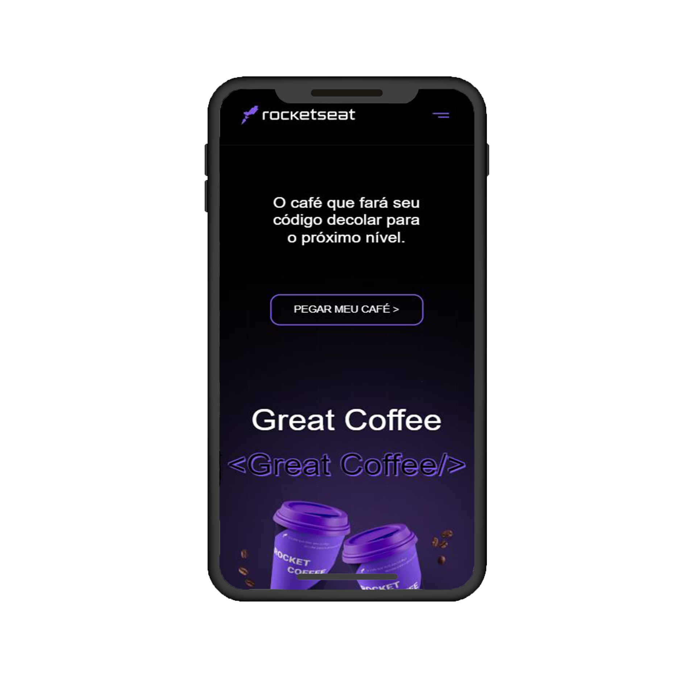
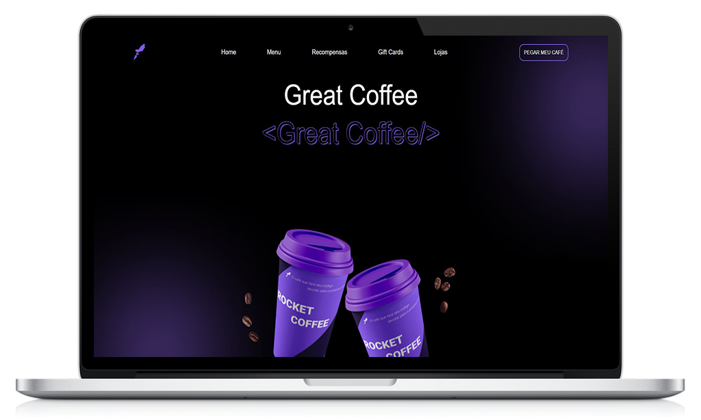

# Desafio RocketCoffee

Esse é um Desafio da RocketSeat "RocketCoffee" 

  

  

## :computer: Tecnologias utilizadas

O projeto foi desenvolvido utilizando as seguintes tecnologias:

- HTML
- CSS
- JavaScript

